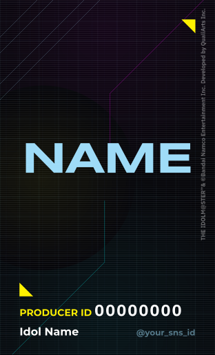
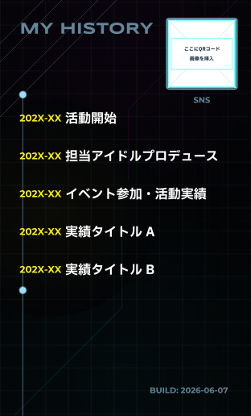

# 学園アイドルマスター プロデューサー名刺 Typst テンプレート

『学園アイドルマスター』のプロデューサー名刺を[Typst](https://typst.app/) (組版用プログラミング言語) を用いて作成するためのテンプレートリポジトリです。

## プレビュー

<table>
  <tr>
    <th align="center">表面</th>
    <th align="center">裏面</th>
  </tr>
  <tr>
    <td align="center"></td>
    <td align="center"></td>
  </tr>
</table>

## 設計について

本テンプレートは「Luna Say Maybe」（月村手毬）の楽曲イメージに基づいて作成されています。配色やレイアウトなどのデザインを変更したい場合は、`main.typ` のソースコードを直接書き換えて調整してください。

## ディレクトリ構成
```text
.
├── README.md           # 本ドキュメント
├── main.typ            # 名刺データの流し込み・個別設定
├── lib.typ             # 名刺デザイン・レイアウトの共通ライブラリ
├── fonts/              # 同梱のオープンソースフォント
├── figs/               # プレースホルダー画像（ダミー画像）
│   ├── background.jpg  # 背景画像（差し替え推奨）
│   └── qr-code.png     # QRコード画像（差し替え推奨）
└── build/              # 出力ディレクトリ（PDF および プレビュー用画像）
```

## 使い方

### 1. 動作環境の準備
ビルドには **Typst (v0.11.0+)** が必要です。

*   macOS (Homebrew): `brew install typst`
*   Nix/NixOS: `nix-env -iA nixpkgs.typst` または `nix-shell -p typst`
*   その他の環境: [Typst公式ドキュメント](https://github.com/typst/typst) を参照してください。

### 2. 名刺情報のカスタマイズ
`main.typ` を開き、各パラメータをご自身の情報に書き換えてください。

```typst
#business-card(
  is-print-ready: false,
  show-guides: false,
  
  producer-name: [NAME],              // プロデューサー名
  producer-id: "00000000",            // プロデューサーID
  sns-id: "@your_sns_id",             // SNSのアカウント名
  idol-name: [Idol Name],             // 担当アイドル名
  
  history: (                          // 裏面の活動履歴
    (year: "202X-XX", title: "活動開始"),
    (year: "202X-XX", title: "担当プロデュース開始"),
    // 必要に応じて項目を追加・変更してください
  ),
  
  qr-image-path: "figs/qr-code.png",  // QRコード画像パス
  qr-label: [SNS],                    // QRコード右下のラベル表記
  bg-image-path: "figs/background.jpg" // 背景画像パス
)
```

#### 画像ファイルの差し替え
*   **背景イラスト**: `figs/background.jpg` をお好みの背景画像で上書きするか、`main.typ` 内の `bg-image-path` に指定する画像パスを変更してください。
*   **QRコード**: `figs/qr-code.png` をご自身のQRコード画像（サイズ目安: 15mm x 15mm 相当）に差し替えてください。

### 3. コンパイル
リポジトリのルートディレクトリで以下のコマンドを実行し、PDF および プレビュー用の画像を書き出します。
同梱のフォントを使用するため、`--font-path ./fonts` オプションを必ず付与してください。

#### PDF の生成
```bash
typst compile main.typ build/main.pdf --font-path ./fonts
```

#### プレビュー画像の生成
```bash
typst compile main.typ build/{n}.png --font-path ./fonts
```

#### 印刷所入稿用の設定（塗り足し対応）
両面印刷の入稿用データ（仕上がり線より外側に3mmの余白を設ける）を作成する場合は、`main.typ` の先頭にある設定変数を `true` に変更してコンパイルしてください。

```typst
#let is-print-ready = true  // true: 3mmの塗り足し(Bleed)を含む, false: 仕上がりサイズでカット
#let show-guides = false     // 必要に応じてトンボ等のガイド線を表示したい場合は true に設定
```

## ライセンス・使用フォントについて

*   **ソースコード (`main.typ`)**: [MIT License](LICENSE) の下で自由に改変・配布いただけます。
*   **フォントファイル (`fonts/`)**:
    *   **Montserrat**, **IBM Plex Sans JP** は [SIL Open Font License 1.1](fonts/OFL.txt) に基づき同梱されています。
    *   **Syncopate** は [Apache License 2.0](fonts/LICENSE-Apache.txt) に基づき同梱されています。
    *   各フォントは再配布条件を満たすため、各ライセンステキストをフォルダ内に格納しています。